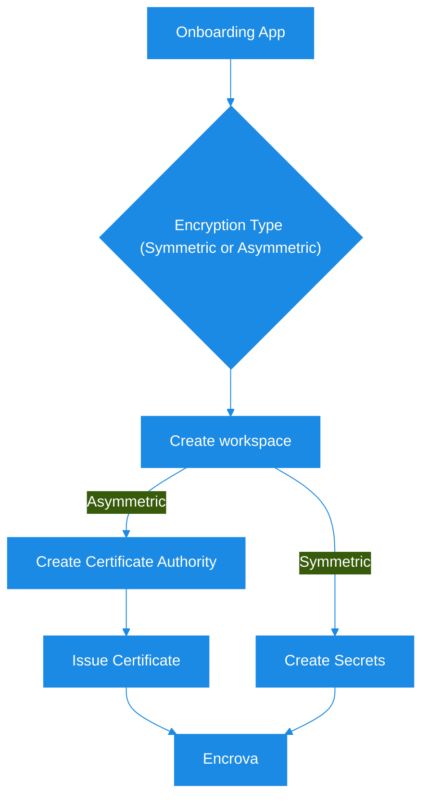
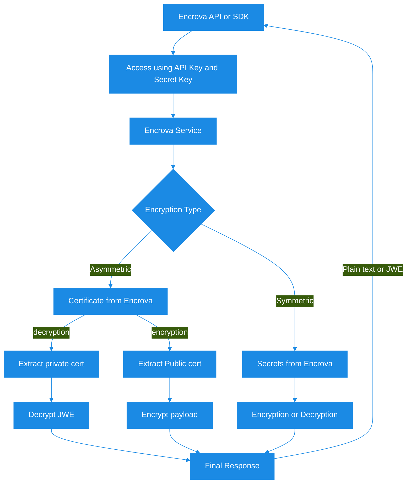

### Onboarding
This flowchart represents the onboarding process for an application that involves encryption. Based on the selected encryption type (Symmetric or Asymmetric), different steps are followed to ensure secure key or certificate management. The final output is either a set of secrets or a certificate, which is then processed or stored in Encrova.
### Process Flow
<ul>
    <li>Onboarding app starts the process.</li>
    <li>Determines the encryption type: Symmetric or Asymmetric.</li>
    <li>Creates a workspace</li>
    <li>
        <b>If Asymmetric Encryption is chosen:</b>
        <ul>
            <li>Sets up a <b>Certificate Authority (CA).</b></li>
            <li>Issues a certificate.</li>
            <li>Stores or processes the certificate in <b>Encrova.</b></li>
        </ul>
    </li>
    <li>
        <b>If Symmetric Encryption is chosen:</b>
        <ul>
            <li>Creates secrets.</li>
            <li>Stores or processes the secrets in <b>Encrova.</b></li>
        </ul>
    </li>

</ul>

### Encryption / Decryption

